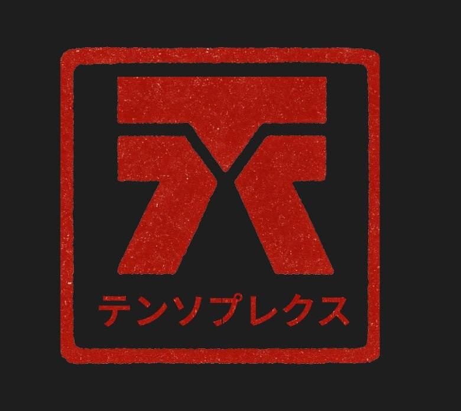

<p align="center">
  <a href="http://tensorplex.ai" target="blank"></a>
</p>


  <p align="center">Tensorplex Kami</p>
    <p align="center">
<a href="https://discord.gg/RBNrKgtBhz" target="_blank"></a>
  <a href="https://x.com/TensorplexLabs" target="_blank"></a>
</p>
  <!--[](https://opencollective.com/nest#backer)
  [](https://opencollective.com/nest#sponsor)-->

## Description

[Nest](https://github.com/nestjs/nest) framework for substrate-related interactions.

## Project setup

```bash
$ npm install
```

## Env setup
| Variable            | Description                                                       | Default Value                               | Remarks                                                                                                                                                     |
| ------------------- | ----------------------------------------------------------------- | ------------------------------------------- | ----------------------------------------------------------------------------------------------------------------------------------------------------------- |
| BITTENSOR_DIR       | Bittensor directory                                               | $HOME/.bittensor                            |                                                                                                                                                             |
| WALLET_COLDKEY      | Bittensor coldkey name                                            | -                                           |                                                                                                                                                             |
| WALLET_HOTKEY       | Bittensor hotkey name                                             | -                                           |                                                                                                                                                             |                                                                                                                       |
| SUBTENSOR_NETWORK   | Network name                                                      | -                                     | if not set, falls back to Latent Holdings Subtensor <br> ws://localhost:9944 (local subtensor)                                                                                             |
| KAMI_PORT   | Port                                                      | 8882                                     | if not set, falls back to 3000                           


## Compile and run the project

```bash
# development
$ npm run start

# watch mode
$ npm run start:dev

# production mode
$ npm run start:prod
```

## API Documentation
The latest documentation can be found at https://kami.tensorplex.ai/. Swagger UI can also be accessed once compiled: ```http://localhost:KAMI_PORT/chain/docs```

## Run tests (Coming soon!)

```bash
# unit tests
$ npm run test

# e2e tests
$ npm run test:e2e

# test coverage
$ npm run test:cov
```

## Stay in touch

- Website - [https://tensorplex.ai](https://tensorplex.ai/)
- Twitter - [@TensorplexLabs](https://x.com/TensorplexLabs)

## License

Tensorplex Kami is [MIT licensed](https://github.com/nestjs/nest/blob/master/LICENSE).
